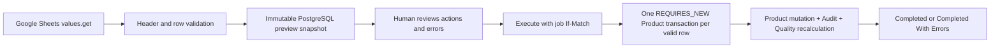

# Milestone 2E — Google Connectors and Final Stage 02 Integration

## Gate status

- Status：Approved for implementation under the existing Stage 02 architecture decisions
- Branch：`codex/2e-specification`
- Base Commit：`29c7011e7d4a7efb32509d615b01337759ab60a0`
- Specification：Complete
- Implementation：Not started
- Migration：Not created
- Local Verification：Not started
- Remote CI：Pending
- Manager Review：Pending
- Manager Decision：Pending
- Human Review Required：No
- Merge：Pending
- Stage 03：Not started

## Objective and authority

Deliver the Stage 02 Google Sheets import and Google Drive folder foundations without changing the System of Record. PostgreSQL remains authoritative; Google Workspace remains an external connector. This is an additive feature within the already-approved `StorageProvider` and Connector boundaries. No real credential, production access, deployment, RBAC, or destructive data operation is authorized.

## Non-negotiable architecture decisions

- PostgreSQL is the only System of Record.
- Google Sheets is previewed and imported on explicit user command; there is no polling, webhook, automatic write-back, or bidirectional synchronization.
- Stage 2E provides the canonical mapping/template as exportable CSV, but writing Product exports into a live Sheet is deferred; a later export must remain a Connector and requires a separately tested idempotent external-write workflow.
- Google Drive is accessed only through `StorageProvider`; the database stores provider IDs and metadata, never file bytes.
- Every Product relation uses immutable `product_uuid`; import matching uses UUID first, then immutable `product_id`. SKU and name are never identity keys.
- Sheet rows with blank UUID and Product ID create Products and receive system-generated identifiers. A present UUID is authoritative and never falls back to Product ID. If both identifiers resolve to different Products, the row is invalid.
- All successful database mutations use a trusted `AuditActorProvider` and Audit in the same database transaction. Browser-provided actor identity is ignored.
- Production remains fail-closed when trusted actor or Google credential configuration is missing.
- Google API tests use Mock/Stub providers. CI never receives live Google credentials or calls Google APIs.

## Delivery slices

1. **2E-1 Sheets persistence and ports** — additive V6, import snapshot/state model, provider ports, mapping contract, constraints, and Testcontainers.
2. **2E-2 Sheets preview and execute** — provider adapter, preview/validation, UUID/Product ID upsert, row transactions, Audit, APIs, and integration tests.
3. **2E-3 Drive StorageProvider** — additive V7, idempotent Product folder tree, Shared Drive support, APIs, Audit, and provider tests.
4. **2E-4 Connector UI** — fixed BFF routes, Sheet preview/execute UI, Product Drive folder UI, conflict/error states, and Frontend tests.
5. **2E-5 E2E and Stage 02 acceptance** — Stub-backed real Compose flows, full regression, Manager Gate, final merge, post-merge CI, and `milestone-2e-complete` plus `stage-02-complete` tags.

No dependent slice starts until the preceding slice is merged and its post-merge `main` CI passes. V6 and V7 are created only in their owning slices and become immutable after merge.

## 2E-1 — V6 Sheets persistence contract

V6 is `V6__create_sheet_import_foundation.sql`. V1–V5 remain byte-for-byte unchanged.

### `sheet_import_jobs`

- `import_job_uuid UUID PRIMARY KEY`
- `provider VARCHAR(32) NOT NULL CHECK (provider = 'GOOGLE_SHEETS')`
- `spreadsheet_id VARCHAR(256) NOT NULL`
- `sheet_name VARCHAR(128) NOT NULL`
- `source_range VARCHAR(256) NOT NULL`
- `source_fingerprint CHAR(64) NOT NULL` containing lowercase SHA-256 of the normalized preview snapshot
- `status VARCHAR(32) NOT NULL CHECK (PREVIEWED, EXECUTING, COMPLETED, COMPLETED_WITH_ERRORS, FAILED)`
- `total_rows`, `valid_rows`, `invalid_rows`, `created_count`, `updated_count`, and `failed_count INTEGER NOT NULL CHECK (>= 0)`
- `created_by VARCHAR(128) NOT NULL`
- bounded nullable `failure_code VARCHAR(64)` and `failure_message VARCHAR(1000)`
- `created_at`, `updated_at TIMESTAMP WITH TIME ZONE NOT NULL`
- `version BIGINT NOT NULL DEFAULT 0`

Database constraints keep totals coherent. UUID, provider, source identity, fingerprint, and creator are immutable. Delete is rejected by a database trigger; lifecycle is represented by status, not hard deletion.

### `sheet_import_rows`

- `import_row_uuid UUID PRIMARY KEY`
- `import_job_uuid UUID NOT NULL REFERENCES sheet_import_jobs(import_job_uuid) ON DELETE RESTRICT`
- `row_number INTEGER NOT NULL CHECK (row_number >= 2)`
- `source_row_hash CHAR(64) NOT NULL`
- `planned_action VARCHAR(16) NOT NULL CHECK (CREATE, UPDATE, INVALID)`
- `match_strategy VARCHAR(16) NOT NULL CHECK (NONE, PRODUCT_UUID, PRODUCT_ID)`
- nullable `target_product_uuid UUID REFERENCES products(product_uuid) ON DELETE RESTRICT`
- nullable `target_product_version BIGINT CHECK (>= 0)` captured during preview
- bounded normalized source-cell columns: `source_product_uuid`, `source_product_id`, `sku`, `product_name`, `brand`, `category`, `subcategory`, `short_description`, `source_cost`, `source_sale_price`, `currency`, `source_stock`, and `product_url`; numeric source cells remain strings so invalid input can be preserved and reported instead of failing preview persistence
- `validation_errors JSONB NOT NULL DEFAULT '[]'` with array-type constraint; entries contain bounded `field`, `code`, and `message`
- `execution_status VARCHAR(16) NOT NULL CHECK (PENDING, SUCCEEDED, FAILED, SKIPPED)`
- nullable result UUID/Product ID and bounded execution error code/message
- `created_at`, `updated_at`, and `version BIGINT NOT NULL DEFAULT 0`
- `UNIQUE (import_job_uuid, row_number)` and indexes on target UUID, planned action, and execution status

Source identity, row number/hash, matching decision, target version, Product snapshot, and validation errors are immutable after preview. Only bounded execution result fields may change. Delete is rejected by a database trigger.

## Canonical Sheet mapping

Header names are exact lowercase snake case:

`product_uuid`, `product_id`, `sku`, `product_name`, `brand`, `category`, `subcategory`, `short_description`, `cost`, `sale_price`, `currency`, `stock`, `product_url`.

- `product_uuid`, `product_id`, and `product_name` headers are required; other headers are optional but unknown nonblank headers reject the preview with `INVALID_SHEET_HEADER`.
- Maximum 1,000 data rows and 13 columns per preview. Bounded Product field lengths and existing currency/money/stock/URL validation are reused.
- Empty trailing rows are ignored. A nonempty row is validated independently and persisted in the preview snapshot.
- Blank optional cells mean explicit null during UPDATE. Product name cannot be blank. System fields, lifecycle, version, timestamps, and archive state are not importable.
- Duplicate UUID/Product ID targets in one preview are invalid; no last-row-wins behavior is allowed.
- A UUID that is malformed or not found is invalid and never falls back to Product ID. A supplied unknown Product ID is invalid and never creates a Product with caller-selected identity.
- Preview reads `FORMATTED_VALUE` rows, normalizes line endings/whitespace deterministically, and stores a SHA-256 snapshot. Execute never silently rereads a changed Sheet.

The mapping document and downloadable CSV template are versioned in the Repository. Formula-like export template cells are not generated. Any later Product export must use Sheets `RAW` values so strings are not interpreted as formulas.

## Sheets preview and execute workflow

- Preview uses the trusted HTTP actor, generates a job UUID, and records one CREATE Audit event for `SHEET_IMPORT_JOB`.
- Execute requires current job `If-Match`. Missing, malformed, and stale tokens return 428, 400, and 412.
- Only `PREVIEWED` jobs execute. Repeating an already completed execute is idempotent and returns the stored result without Product or Audit duplication.
- Each valid row runs in an independent transaction so one invalid/stale row cannot silently roll back successful rows. Product mutation, Product Audit, Quality recalculation, and row result commit together.
- UPDATE verifies the Product version captured at preview. A changed Product fails that row with `STALE_PRODUCT`; it is never overwritten.
- CREATE uses the application UUID generator and existing PostgreSQL Product ID sequence. Gaps remain allowed.
- Job status/count finalization occurs after row transactions. Unexpected interruption leaves `EXECUTING`; a bounded SYSTEM recovery operation may resume only PENDING rows using a server-generated request ID.
- Every operation retains one nonempty request ID. System recovery uses explicit `SYSTEM`; Browser `X-Actor-ID` is never accepted.

## Sheets REST and BFF contract

- `GET /api/connectors/google-sheets/template`
- `POST /api/connectors/google-sheets/imports/preview`
- `GET /api/connectors/google-sheets/imports/{importJobUuid}`
- `POST /api/connectors/google-sheets/imports/{importJobUuid}/execute`

Preview accepts only `spreadsheetId`, `sheetName`, and an optional bounded A1 `range`. The adapter constructs a fixed `https://sheets.googleapis.com` request; Browser input can never choose scheme, host, port, credential, or arbitrary URL. Responses expose row actions/errors and job ETag but never access tokens or Google error bodies.

## 2E-3 — V7 Drive persistence contract

V7 is `V7__create_product_storage_folders.sql`. V1–V6 remain immutable.

### `product_storage_folders`

- `storage_folder_uuid UUID PRIMARY KEY`
- `product_uuid UUID NOT NULL UNIQUE REFERENCES products(product_uuid) ON DELETE RESTRICT`
- `storage_provider VARCHAR(32) NOT NULL CHECK (storage_provider = 'GOOGLE_DRIVE')`
- `root_folder_id VARCHAR(256) NOT NULL`
- nullable `shared_drive_id VARCHAR(256)`
- `product_folder_id VARCHAR(256) NOT NULL UNIQUE`
- optional `provider_metadata JSONB` for bounded provider-only metadata
- `created_at`, `updated_at`, and `version BIGINT NOT NULL DEFAULT 0`

### `product_storage_subfolders`

- `storage_subfolder_uuid UUID PRIMARY KEY`
- `storage_folder_uuid UUID NOT NULL REFERENCES product_storage_folders(storage_folder_uuid) ON DELETE RESTRICT`
- `folder_role VARCHAR(32) NOT NULL CHECK (ORIGINAL, IMAGES, VIDEOS, DOCUMENTS, CAMPAIGNS, ARCHIVE)`
- `provider_folder_id VARCHAR(256) NOT NULL`
- `created_at TIMESTAMP WITH TIME ZONE NOT NULL`
- `UNIQUE (storage_folder_uuid, folder_role)` and `UNIQUE (provider_folder_id)`; Google Drive IDs are opaque provider-global identifiers in this table

Identity, Product association, provider, root/shared-drive scope, and folder IDs are immutable. DELETE is rejected. Stage 2E never deletes, moves, or renames provider folders.

## Drive StorageProvider workflow

- Configuration: required `GOOGLE_DRIVE_ROOT_FOLDER_ID`; optional `GOOGLE_SHARED_DRIVE_ID`. Production prefers Shared Drive.
- Folder layout: `PRODUCT_ID/{original,images,videos,documents,campaigns,archive}` beneath the configured root.
- The Google adapter searches by fixed parent plus provider `appProperties` (`product_uuid`, `folder_role`) before creating. Retry therefore reuses partially-created folders after a network/database failure.
- Shared Drive requests set `supportsAllDrives=true`; searches also use `includeItemsFromAllDrives=true`, `corpora=drive`, and the configured `driveId`.
- Provider file/folder IDs are treated as opaque bounded identifiers. Names are escaped by the client library/JSON serializer and never interpolated into arbitrary URLs or Drive query syntax without validation.
- First successful ensure returns 201; repeated ensure returns 200 with the same database/provider IDs and no duplicate Audit.
- Product archive does not delete or move folders. Archive-folder usage by later asset workflows is outside Stage 2E.
- External API completion and database commit cannot be atomic. Search-before-create/appProperties make recovery idempotent; the database is written only after the complete tree is known.

REST endpoints:

- `GET /api/products/{productUuid}/storage-folder`
- `POST /api/products/{productUuid}/storage-folder`

The POST is blocked for archived Products, uses the trusted actor, and writes `PRODUCT_STORAGE_FOLDER` Audit in the database transaction that persists the folder tree.

## Provider and credential implementation

- Ports: `SheetValuesProvider` and `StorageProvider`; application/domain code never depends on Google SDK classes.
- Production adapter uses fixed Google REST API v4/v3 endpoints, Spring's existing HTTP client facilities, and pinned `com.google.auth:google-auth-library-oauth2-http:1.43.0` for Application Default Credentials.
- Allowed scopes are limited to Sheets values access and Drive file/folder access required by the connector.
- ADC may resolve `GOOGLE_APPLICATION_CREDENTIALS` or workload identity supplied by the runtime. No credential JSON, token, private key, or service-account content is accepted in Browser requests, committed files, Docker build arguments, logs, Audit, or API responses.
- Local/test profiles use explicit deterministic Stub providers. Default/production profiles fail closed when provider configuration or ADC is unavailable.
- Connect/read timeouts and retries are bounded. Retry only 429/5xx/idempotent reads or folder ensure operations; validation/permission errors are not retried indefinitely.
- Tests assert redaction of Authorization and provider error details.

Official protocol references:

- [Google Sheets values resource](https://developers.google.com/workspace/sheets/api/guides/values)
- [Google Drive Shared Drive support](https://developers.google.com/workspace/drive/api/guides/enable-shareddrives)
- [Application Default Credentials](https://docs.cloud.google.com/docs/authentication/application-default-credentials)

## Connector UI

- `/connectors/google-sheets` provides source entry, Preview, row-level action/error table, counts, and Execute confirmation.
- Execute is disabled when no valid rows exist, while the job is running, or when its ETag is absent/stale.
- 409/412/428, provider unavailable, permission, quota, timeout, empty Sheet, invalid header, and row errors have distinct recoverable states.
- Product detail Assets area displays Drive folder state and offers idempotent “Create folder structure” for active Products.
- Browser uses only fixed Next.js Route Handlers. No generic proxy, arbitrary URL, Cookie, Authorization, Google token, or Browser actor forwarding is permitted.

## Audit entities and changes

- Entity types: `SHEET_IMPORT_JOB`, `PRODUCT_STORAGE_FOLDER`, plus existing `PRODUCT` and Quality entities.
- Import job CREATE and effective status/count UPDATE changes are audited. Row-level successful Product CREATE/UPDATE uses the existing Product Audit contract and records only actual field changes.
- Invalid, stale, failed, and skipped rows do not create Product Audit.
- Folder creation records provider/root/shared-drive/product/subfolder IDs through existing redaction and 4,096-character truncation. Credentials and raw Google error payloads are never Audit values.
- No-op execute and no-op folder ensure create neither version changes nor Audit.

## Error codes

- `CONNECTOR_NOT_CONFIGURED`, `GOOGLE_AUTH_UNAVAILABLE`, `GOOGLE_PERMISSION_DENIED`, `GOOGLE_RATE_LIMITED`, `GOOGLE_PROVIDER_UNAVAILABLE`
- `INVALID_SPREADSHEET_ID`, `INVALID_SHEET_RANGE`, `INVALID_SHEET_HEADER`, `SHEET_EMPTY`, `SHEET_ROW_LIMIT_EXCEEDED`
- `IMPORT_JOB_NOT_FOUND`, `IMPORT_JOB_STATE_CONFLICT`, `IMPORT_JOB_STALE`, `STALE_PRODUCT`
- `STORAGE_FOLDER_NOT_FOUND`, `STORAGE_FOLDER_STATE_CONFLICT`, `PRODUCT_ARCHIVED`

All errors retain the standard `code`, `message`, `requestId`, `timestamp`, `path`, and optional `fieldErrors`. Stack traces, credentials, provider response bodies, and internal URLs are never returned.

## Test matrix

### Migration and database

- Empty database V1→V6→V7, populated V5 upgrades, repeat migration, Hibernate validate, and immutable V1–V5 checksum tests.
- Direct JDBC checks for all enums/ranges/FKs/uniques/JSON shape, immutable identity/source triggers, and DELETE rejection.
- V6 scope test proves Drive tables absent; V7 adds only approved Drive tables.

### Sheets

- Header mapping, whitespace/line-ending normalization, maximum rows/lengths, money/currency/stock/URL validation, and row fingerprint determinism.
- UUID priority, Product ID fallback, create-with-blank-IDs, mismatched IDs, missing targets, duplicate targets, SKU non-identity, and explicit-null update semantics.
- Preview snapshot stability, ETag/state transitions, idempotent execute, stale Product rejection, partial success, interruption recovery, sequence gaps, Audit/request ID/actor, rollback, and Quality recalculation.
- Mock provider verifies fixed origin/path, encoded A1 range, bounded timeouts/retries, scopes, and sanitized errors.

### Drive

- My Drive and Shared Drive request parameters, fixed root, appProperties search-before-create, exact six roles, partial-failure retry, idempotent ensure, archived Product block, Audit, and database rollback recovery.
- Mock provider verifies no credentials/internal provider errors escape and no user-controlled URL/query injection is possible.

### Frontend and E2E

- BFF allowlists, method/content type/body limits, ETag/header forwarding, timeout/error mapping, and no credential/actor forwarding.
- Preview/execute table and error UX; folder create/read UX; loading/empty/error/conflict states; mobile layout.
- Real Compose E2E uses deterministic Stub providers to preview mixed create/update/error rows, execute partial success, reload results, create/reuse Drive folders, and confirm Product Aggregate/Quality changes.
- Full Backend, Frontend, migration, Compose, smoke, seven existing Playwright tests, new Connector Playwright tests, npm audit, Gitleaks, and actionlint regression.

## Security, data, and rollback

- No live credential or production access is part of CI or acceptance. Enabling a real production Service Account, workload identity, Shared Drive, or deployment is a separate human-approved operation.
- Spreadsheet/folder IDs and A1 ranges are validated; provider origins are constants. Connector inputs cannot produce SSRF.
- Row counts, cell sizes, request bodies, timeouts, retries, and error payloads are bounded. Sensitive headers/body fields are never logged.
- V6/V7 are additive and transactional. Rolling back the Runtime leaves connector tables unused; merged migrations are never edited.
- Product row transactions prevent partial Product/Audit/Quality state. External Drive side effects are recoverable through deterministic search-before-create, not destructive cleanup.
- Dropping connector tables, deleting provider folders/files, mass importing production data, changing System of Record, or enabling live credentials requires `ESCALATE_TO_HUMAN`.

## Stage 2E acceptance

- [ ] V6/V7 migrate empty and populated databases without changing V1–V5.
- [ ] Sheet mapping/template, Preview, validation, UUID/Product ID matching, create/update, partial error report, idempotency, stale protection, Audit, and Quality recalculation pass.
- [ ] Drive folder creation persists root/Product/six subfolder IDs and is idempotent for My Drive and Shared Drive semantics.
- [ ] Production fails closed without trusted actor/provider configuration; CI uses no real Google credential or network call.
- [ ] Fixed BFF/UI flows and Connector E2E pass with Stub providers.
- [ ] All Stage 02 Backend, Frontend, migration, Compose, smoke, Playwright, audit, dependency, secret, and workflow checks pass locally and remotely.
- [ ] No Sheets polling/two-way sync, file upload/delete, live export write-back, AI, Meta Ads, Dashboard, Decision Engine, or Stage 03 scope is introduced.
- [ ] Every slice receives exact-head Manager `APPROVE`, merge, and post-merge verification before the next slice starts.
- [ ] Final Stage 02 acceptance is merged, post-merge main CI passes, and `milestone-2e-complete` plus `stage-02-complete` tags are created.
